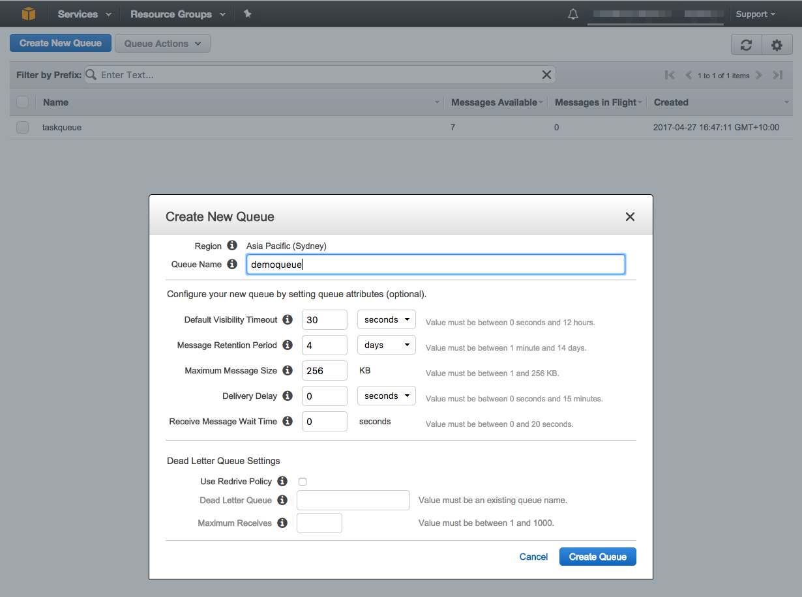
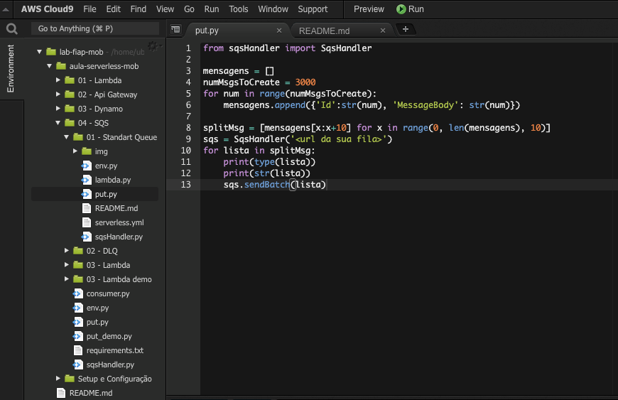

# Aula 04.1 - Standart Queue

### Criando a fila sqs
1. Crie uma fila no sqs colocando o nome 'demoqueue', deixe os valores default e clique em 'Criar Fila'

2. Copie a URL da sua fila. É a segunda informação da sua aba 'Detalhes' quando a fila esta selecionada.
### Enviando dados para a fila
1. No terminal do IDE criado no cloud9 execute o comando `cd ~/environment/Hackaton-exercises-serverless/04-SQS/01\ -\ Standart\ Queue/` para entrar na pasta que fara este exercicio.
2. Altere o arquivo put.py adicionando a URL da fila do sqs que criou nos passos anteriores

3. Execute o comando `python3 put.py` no terminal para colocar 3000 mensagens na fila.

### Consumindo SQS 

1. Cria mais uma fila sqs com o mesmo nome da anterior com o sulfixo '_dest'
2. Execute o comando no terminal `sls create --template "aws-python3"`
3. Altere o arquivo 'serverless.yml' e coloque o seguinte conteudo, não esqueça de preencher as duas URLs das filas como descrito:
#### IGNORE A PARTE DE EVENTS COM SCHEDULE, NÃO FUNCIONA NO VOCAREUM

1. Altere o arquivo 'handler.py' com o seguinte conteudo

7. rode o comando `sls deploy`
8. Coloque alguns itens na fila, lembrando que cada execução do lambda criado pode consumir até 1000 posições da fila sqs.
9. Para execução do lambda rode o comando `sls invoke -l -f sqsHandler` no terminal
10. Enquando espera o comando terminar pode observar no painel do SQS as mensagens se movendo a cada atualização manual pelo canto direito superior. Lembre que cada execução move 1000 por definição no código.
    
12. Execute o invoke algumas vezes para zerar a fila.
12. Execute o comando `sls remove` no terminal para remover o que foi criado.
13. Vá até o painel do sqs, selecione as 2 filas que utilizou no exercicio, clique em 'Ações de fila' e depois em 'Eliminar Filas'. Confirme. Essa ação vai tirar todos os items das 2 filas.

