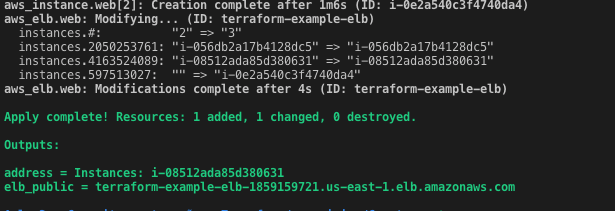
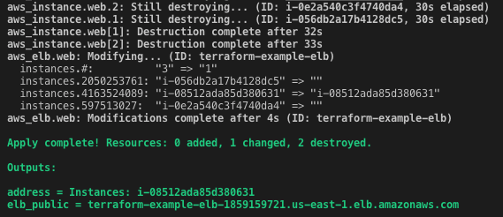

1. Execute o comando `cd ~/environment/Hackaton-exercises-terraform/demos/Count/` para entrar no diretório do exercício.
2. Execute o comando `terraform init`
3. Execute o comando `terraform apply -auto-approve`
4. Aguarde alguns minutos para que todas as maquinas estejam prontas no ELB. Para chegar até o painel de Load Balancers, entre no serviço EC2 e no menu esquerdo escolha 'Load Balancers'
   
5. Quando estiverem todas prontas estarão como na imagem
   
6. Utilize o dns do ELB fornecido como saida no terraform para colar no navegador e testar o funcoinamento da Stack
   
7. Agora vá até o arquivo `main.tf`(Hackaton-exercises-terraform/demos/Count) pelo IDE e altere o valor do count para 3
   
8. Execute novamente o comando `terraform apply -auto-approve`
   
9.  Note no painel da AWS que a maquina foi criada e já colocado no ELB
   
11. Vá novamente até o arquivo `main.tf` e altere o valor do count para 1
12. Execute novamente o comando `terraform apply -auto-approve`
    
13. Dessa vez foram 2 destruições de maquina e uma alteração no ELB
    
14. Execute o comando `terraform destroy -auto-approve`

### Exercicio
Caso deseje fazer um exercicio prático para ajudar a fixar o conteudo faça o proposto na seguinte página: [Exercício](../../exercicios/count/README.md)